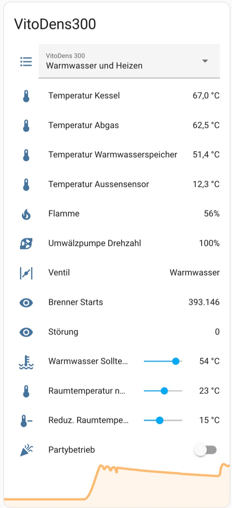

# Optolink

This project reads some data from a Viessmann Vitodens 200-W with Vitotronic 200 VScotHO1 (2019) and sends it to an MQTT broker if necessary. Error codes are translated into error messages. 
The data points are automatically displayed in the web interface with the current value. Current values ​​are reloaded via AJAX.
In this repository the value addresses were adapted to a vitotronic 200 H01 id code 0x20C2.

[Project details on my blog](https://blog.mt88.eu/2022/10/27/viessmann-heizungsdaten-2-0/)

## Fork by Stefan Rinke
Command topic on MQTT &lt;prefix&gt;/set/&lt;name&gt; for setting values over mqtt.
currently supported:

  - Betriebsart: values 0 (Frostschutz), 1 (nur WW), 2 (WW + Heizen)
  - Partybetrieb: 0, 1 (off/on)
  - RaumSollTemp: (non reduced) room target temperature
  - WarmwasserSollTemp: target temperature for hot water
  
The integration into Home Assistant currently looks like this:

## Hardware
used a D1 mini pro

and the wiring looks like this:

(C) by openv project

However, the implementation here uses a "SoftSerial" instance for communication with the VitoDens.
RX = D2 und TX = D1

## Setup

 - connect to WiFi "optolink_config".
 - Go to 192.168.0.1 in the browser
 - Enter WLAN access data
 - Enter NTP server IP (optional)
 - Enter MQTT broker IP (optional)
 - Adjust MQTT topic prefix (optional)
 - Adjust MQTT client ID (optional)
 - Change the log (P300 / KW) to two files (viessmann.h, viessmann.cpp) (optional)

## Features

 - If no connection to the WLAN can be established when starting the module (e.g. after initial setup), the WLAN settings are reset after about 1.5 minutes and the configuration mode is activated again.

 - The settings can also be changed later via the web interface.

 - The settings are persistently stored in the flash memory.

 - Notification of failure

 - Log entries in the web interface with date and time due to NTP integration

 - If no data can be read via the infrared interface, the module sends optolink/error = 1 (with standard topic prefix) via MQTT, waits a minute and tries again.
This behavior also ensures that the heater restarts after a power failure. When starting the heater, no infrared signals may be sent, otherwise the heater will get stuck in a start loop.

 - The module can be flashed afterwards via WLAN (OTA).

 - Values ​​of the data points are clearly displayed in the web interface (responsive design) with automatic updating (AJAX)

 

