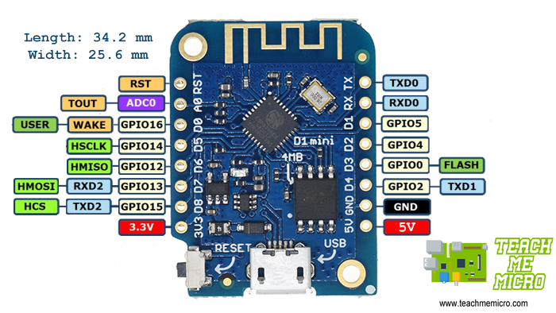

# Optolink

Dieses Projekt liest von einer Viessmann Vitodens 200-W mit Vitotronic 200 VScotHO1 (2019) einige Daten aus und sendet diese bei Bedarf an einen MQTT Broker.
Fehlercodes werden in Fehlermeldungen übersetzt.
Die Datenpunkte werden automatisch im Webinterface mit dem aktuellen Wert angezeigt. Aktuelle Werte werden per AJAX nachgeladen.

[Projektdetails auf meinem Blog](https://blog.mt88.eu/2022/10/27/viessmann-heizungsdaten-2-0/)

## Fork by Stefan Rinke
Command topic für MQTT &lt;prefix&gt;/set/&lt;name&gt; um Werte auch über mqtt steuern zu können
Im Moment unterstützt:

  - Betriebsart: Werte 0 (Frostschutz), 1 (nur WW), 2 (WW + Heizen)
  - Partybetrieb: 0, 1 (aus/an)

TODO: Evtl. auto discovery für Home Assistant dazu

## Hardware
verwendet wird ein D1 mini

und der Aufbau sieht so aus:

(C) by openv project

Die Implementierung hier verwendet allerdings eine "SoftSerial" Instanz zur Kommunikation mit der VitoDens.
RX = D2 und TX = D1

## Einrichtung

 - mit WLAN "optolink_config" verbinden
 - 192.168.0.1 im Browser aufrufen
 - WLAN-Zugangsdaten eingeben
 - NTP-Server IP eingeben (optional)
 - MQTT-Broker IP eingeben (optional)
 - MQTT Topic Prefix anpassen (optional)
 - MQTT Client Id anpassen (optional)
 - Änderung des Protokolls (P300 / KW) in zwei Dateien ändern(viessmann.h, viessmann.cpp) (optional)

## Features

 - Kann beim Start des Moduls (z.B. nach Ersteinrichtung) keine Verbindung zum WLAN hergestellt werden, werden die WLAN-Einstellungen nach etwa 1,5 Minuten zurückgesetzt und somit der Konfigurationsmodus wieder aktiviert.

 - Die Einstellungen können auch nachträglich noch über das Webinterface verändert werden.

 - Die Einstellungen werden im Flash-Speicher persistent gespeichert.

 - Benachrichtigung bei Störung

 - Logeinträge im Webinterface mit Datum und Uhrzeit, da NTP Integration

 - Falls keine Daten über die Infrarotschnittstelle gelesen werden können, sendet das Modul optolink/error = 1 (bei Standard Topic Prefix) über MQTT, wartet eine Minute und versucht es erneut.
Durch dieses Verhalten wird auch sichergestellt, dass die Heizung nach einem Stromausfall wieder startet. Beim Start der Heizung dürfen keine Infrarotsignale gesendet werden, da die Heizung sonst in einer Start-Schleife hängen bleibt.

 - Das Modul lässt sich im Nachgang über WLAN(OTA) flashen.

 - Werte der Datenpunkte werden im Webinterface übersichtlich dargestellt (responsives Design) mit automatischer Aktualisierung (AJAX)
 
 

